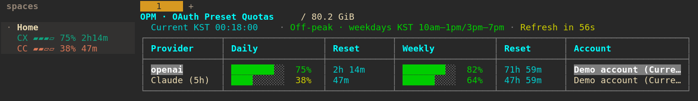

# 🔐 OAuth Preset Manager

프리셋 하나로 같은 OpenAI OAuth 계정을 OpenCode, Codex, claude-code-proxy의 Codex 제공자에 함께 적용하는 도구입니다. 다른 제공자의 인증 항목도 프리셋으로 관리합니다.

---

## ⚡ 빠른 설치

```bash
curl -sSL https://raw.githubusercontent.com/kmss1258/oauth-preset-manager/main/install.sh | bash
```

> **참고:** `~/.local/bin`을 PATH에 추가해야 할 수 있습니다. 설치 프로그램이 안내해드립니다.

> 설치 프로그램은 PATH에서 쓰기 가능한 첫 디렉터리(없으면 `~/.local/bin`)에 `opm` 실행기를 만듭니다.

## 🚀 빠른 시작

그냥 실행하세요:
```bash
opm
```

끝! 🎉 화살표 키로 프리셋을 선택하고 전환하세요.

이미 설치되어 있어도 아래 설치 명령을 다시 실행하면 기존 설치를 업데이트합니다.

OpenCode는 Linux와 macOS에서 모두 XDG 스타일 경로를 사용하며, `XDG_DATA_HOME` / `XDG_CONFIG_HOME`가 있으면 이를 따릅니다.

일반적인 인증 파일 위치:
- OpenCode: `~/.local/share/opencode/auth.json` 또는 `~/.config/opencode/auth.json`
- Codex CLI: `~/.codex/auth.json` (일반 프리셋 전환 시 함께 적용하며 Herdr 사이드바에서 읽기 전용으로 조회)
- claude-code-proxy의 Codex 제공자 전용: `~/.config/claude-code-proxy/codex/auth.json`
- Command Code: `~/.commandcode/auth.json` (OPM은 `~/.commandcode/oauth.json`도 확인합니다)
- Claude Code: `~/.claude/.credentials.json`

---

## ✨ 주요 기능

- 🔄 **빠른 전환**: 여러 OAuth 계정 간 즉시 전환
- 💾 **프리셋 관리**: 여러 인증 상태를 저장하고 정리
- 📊 **쿼터 조회**: `opm q` / `opm quota`로 Rich 표 형식으로 확인하며, 대화형 화면은 60초마다 자동 갱신되고 표 위에 다음 갱신 카운트다운을 표시
- 📱 **모바일 터미널**: 좁은 창에서는 계정별 짧은 막대와 잔여율을 표시하고, 100열 이상에서는 전체 표를 표시합니다. 창 크기 변경은 추가 API 호출 없이 즉시 반영합니다.
- Account 칸의 프리셋 목록은 마지막 사용일(`last_used`, 없으면 생성일 `created_at`) 최신순 최대 2개만 표시합니다. 날짜가 없으면 뒤로 보내며, Command Code 계정 정보는 최대 2줄입니다. 표시만 줄이고 조회 대상이나 계정 행은 유지합니다.
- 화면 높이가 부족하면 `j`/`k`, 아래/위 화살표, Page Down/Page Up으로 페이지를 이동합니다. 카운트다운은 고정됩니다. `g`는 Google 상세 표시, `q`·Esc·Enter·Ctrl-C는 종료이며 이전 터미널 화면을 복원합니다.
- Claude OAuth의 5시간·주간·모델별 쿼터도 지원합니다. 아래 인증 조건을 확인하세요.
- 피크 시간은 고정된 평일(월–금) UTC 01:00–04:00 / KST 10:00–13:00, UTC 06:00–10:00 / KST 15:00–19:00이며 주말은 쉽니다. 시작 1시간 전부터 `HH:MM:SS` 카운트다운을 표시하고, 피크 중에는 TTY 화면의 테두리가 파스텔 무지개색으로 회전합니다. 서머타임은 적용하지 않습니다.
- 인증 배포에서는 먼저 정확한 top-level 인증 항목을 선택하고, 다음 대상 프리셋을 선택합니다(대상은 기본적으로 모두 선택). 선택한 키만 덮어쓰며 선택하지 않은 OAuth/API 항목은 모두 유지됩니다. OpenAI kickoff에는 `gpt-5.6-luna`를 사용합니다.
- OpenCode Go API 인증(`opencode-go:api`)과 브라우저/사용량 세션(`OpenCode Go OAuth session`)은 별개입니다. 세션은 `auth.json`에 넣지 않고 `~/.config/oauth-preset-manager/preset-sidecars/opencode-go/` 사이드카에 저장합니다.
- 🔒 **자동 백업**: 전환 전 자동 백업으로 안전하게
- ⚡ **간단한 명령어**: `save`와 `switch` 두 개면 충분!

## 📖 사용법

### 🎯 인터랙티브 모드 (추천)

인자 없이 실행하면 인터랙티브 모드로 진입합니다:

```bash
opm
```

메뉴에서 다음을 할 수 있습니다:
- ⬆️⬇️ 화살표 키로 프리셋 탐색 및 선택
- 👀 각 프리셋에 포함된 서비스 확인
- ⚡ 프리셋 즉시 전환
- 💾 새 프리셋 저장
- 🔗 인증 항목과 대상 프리셋을 순서대로 선택해 배포

### 💻 명령줄 모드

**현재 인증을 프리셋으로 저장:**
```bash
opm save work
opm save personal
```

**프리셋으로 전환:**
```bash
opm switch work
opm switch personal
```

**할당량 확인:**
```bash
opm quota
# 또는
opm q
```
> 피크 카운트다운은 다음 quota 자동 갱신 카운트와 같은 줄에 표시됩니다. `r` 또는 `ㄱ`은 기존처럼 즉시 갱신하고, 비대화형 출력에서는 ANSI 애니메이션을 사용하지 않습니다.
> 넓은 창은 표, 모바일·좁은 창은 작은 프로그레스바로 보여줍니다. 높이가 극도로 작으면 상태/종료 표시만 남기고, 창을 키우면 복원됩니다. 파이프 출력은 커서 제어·페이지 나눔 없이 한 번만 출력합니다.
> 대화형 쿼터 화면은 60초마다 자동 갱신됩니다. 표 바로 위의 다음 갱신 카운트다운을 확인하거나 `r` 또는 `ㄱ`으로 즉시 갱신할 수 있습니다.

### Herdr: 왼쪽 Spaces 실시간 쿼터

Herdr 안에서 **홈(`~`)이든 어디서든 평소처럼 `opm q`**를 실행하세요. 기존 쿼터 화면은 유지하고, 명령을 실행한 Space 아래에도 두 줄을 표시합니다. 아래 숫자는 예시입니다.



*예시 쿼터 데이터로 실행한 실제 Herdr 터미널 캡처입니다. 실제 계정 정보는 포함하지 않았습니다.*

- **CX는 초록, CC는 주황**입니다. 저장된 프리셋 전체가 아니라 **활성 네이티브 Codex·Claude Code의 파일 기반 계정**입니다. %는 남은 쿼터, 시간은 리셋까지 남은 시간입니다. Codex는 5시간 구간을 우선 사용하고 없으면 실제 primary 구간을 사용합니다. 주간 전용은 `7d`, 불명확한 구간은 `quota`로 구분합니다.
- Herdr 본체 수정·추가 pane·Space 이름 변경·별도 데몬이 없습니다. Herdr 0.8.2의 workspace metadata와 컬러 Space 행을 사용합니다. **펼친 데스크톱 사이드바**에서만 표시되며 접힌 상태/모바일 레이아웃에서는 보이지 않습니다.
- 쿼터는 60초마다 조회하고 남은 시간·표시 유효기간은 15초마다 갱신합니다. `r`/`ㄱ` 수동 갱신도 연결되며 429 대기 시간을 우회하지 않습니다. Claude는 먼저 조회하고 실패하면 마지막 성공값을 표시합니다. **`CC*`는 실시간 값이 아닌 캐시**라는 뜻입니다. 사용 가능한 캐시가 없으면 `login`, `expired`, `auth`, `429`, `error`를 표시합니다. 사이드바 수집기는 사용량 GET만 실행하며 인증 갱신·인증 파일 덮어쓰기·추론을 하지 않습니다.
- `opm q`를 종료하면 두 줄을 지우고, 강제 종료되면 마지막 표시가 45초 이내 만료됩니다. 같은 Space에서 여러 개를 실행하면 하나만 보고하며 해당 프로세스 종료 후 대기 중인 다른 실행이 15초 이내 이어받습니다. 다른 Space는 독립적으로 표시하고, pane을 옮기면 다음 갱신 때 새 Space를 따라갑니다.
- 첫 실행 시 Herdr 설정을 옆에 백업(`config.toml.opm-backup-*`)하고 기존 키·테마·Space 행·주석을 보존한 채 두 행만 등록합니다. 설정 검사 후 reload하며 `HERDR_CONFIG_PATH`를 따릅니다. 지원하지 않는 구문/잘못된 설정은 덮어쓰지 않고 연동 경고만 표시하며 기존 쿼터 화면은 유지합니다. Herdr 밖이나 파이프 출력에서는 설정/표시 작업을 하지 않습니다.

참고: [Herdr 0.8.2 사이드바 설정](https://herdr.dev/docs/0.8.2/configuration/), [workspace metadata 명령](https://herdr.dev/docs/cli-reference/).

## 🔧 작동 원리

OAuth Preset Manager는 OpenCode 인증 파일(`~/.local/share/opencode/auth.json`)을 다음과 같이 관리합니다:

1. **저장**: 현재 인증 상태의 스냅샷 생성
2. **전환**: 현재 인증을 저장된 프리셋으로 교체
3. **백업**: 전환 전 자동 백업

프리셋은 `~/.config/oauth-preset-manager/presets/`에 저장됩니다. 네이티브 Codex 토큰 묶음은 같은 프리셋에 연결된 사이드카로 보관합니다.

## 📝 사용 예시

```bash
# 1. 현재 회사 계정을 저장
$ opm save work
✓ Saved preset: work
Services: anthropic, openai, google, zai-coding-plan

# 2. OpenCode에서 로그아웃하고 개인 계정으로 로그인
# ... (OpenCode에서 로그아웃/로그인)

# 3. 개인 계정을 저장
$ opm save personal
✓ Saved preset: personal
Services: anthropic, openai

# 4. 언제든지 회사 계정으로 전환
$ opm switch work
✓ Switched to preset: work
Services: anthropic, openai, google, zai-coding-plan

# 또는 인터랙티브 모드 사용
$ opm
# 화살표 키로 메뉴에서 선택
```

## ⚙️ 설정

첫 실행 시 `opm`은 자동으로 OpenCode 인증 파일을 감지합니다:
```
~/.local/share/opencode/auth.json
```

OpenCode는 Linux와 macOS에서 모두 XDG 스타일 경로를 사용하며, `XDG_DATA_HOME` / `XDG_CONFIG_HOME`가 있으면 이를 따릅니다.

다른 위치에 있다면 경로를 입력하라는 메시지가 표시됩니다.

### 환경 변수
- `OPM_LANG`: 언어 설정 (`ko` 또는 `en`)
- `CODEX_HOME`: Codex 전용 디렉터리 재정의. 앞뒤 공백을 제거하고 비어 있으면 `~/.codex`를 사용합니다. 값이 있으면 해당 경로가 없거나 잘못되어도 기본 경로로 돌아가지 않습니다.
- `CCP_CONFIG_DIR`: claude-code-proxy 루트 재정의. `<루트>/codex/auth.json`에 씁니다. 없으면 Linux는 `${XDG_CONFIG_HOME:-~/.config}/claude-code-proxy`, macOS는 `~/.config/claude-code-proxy`, Windows는 `%APPDATA%/claude-code-proxy`(APPDATA가 없으면 통상적인 `~/AppData/Roaming` 하위)를 사용합니다. 앞뒤 공백을 제거하며, 명시한 경로에 오류가 있어도 기본 경로로 돌아가지 않습니다.
- `OPM_ANTIGRAVITY_CLIENT_ID`: Google/Antigravity 할당량 갱신에 필요
- `OPM_ANTIGRAVITY_CLIENT_SECRET`: Google/Antigravity 할당량 갱신에 필요
- `OPENCODE_GO_WORKSPACE_ID`: OpenCode Go quota 조회용 workspace ID (`wrk_...`)
- `OPENCODE_GO_AUTH_COOKIE`: OpenCode Go quota 조회용 `opencode.ai`의 `auth` 쿠키
- `OPM_COMMAND_CODE_AUTH_PATH`: Command Code 인증 파일 경로 재정의
- `CLAUDE_CONFIG_DIR`: Claude Code 프로필 디렉터리 (기본 `~/.claude`)
- `OPM_CLAUDE_AUTH_PATH`: Claude Code `.credentials.json` 경로 재정의 (`CLAUDE_CONFIG_DIR`보다 우선)

### 한 번에 세 대상 전환

```bash
opm save work             # OpenCode 저장 및 실제로 일치하는 원본 ID 토큰 묶음 보관
opm switch work           # 같은 OpenAI OAuth 인증을 두 앱과 프록시에 함께 적용
opm                       # 메뉴에서 프리셋을 선택해도 같은 통합 전환 실행
```

별도의 Codex/프록시 프리셋 선택이나 하위 메뉴는 없습니다. OpenAI OAuth(`openai` 또는 `codex` 별칭)가 있으면 OpenCode, 네이티브 Codex, [raine/claude-code-proxy](https://github.com/raine/claude-code-proxy)의 **Codex 제공자만** 함께 전환합니다. 별칭이 충돌하면 거부합니다. OpenAI OAuth가 없으면 Codex와 프록시 인증을 건너뛰었다고 표시하고 기존 파일과 설정을 유지합니다.

- **전환 전에 OpenCode, Codex, claude-code-proxy를 모두 종료하고 완료 후 모두 다시 실행하세요.** 프록시는 요청마다 인증 파일을 읽지만 연결 풀의 웹소켓이나 동시 토큰 갱신이 이전 인증을 유지하거나 파일 쓰기와 충돌할 수 있어 실행 중 자동 반영을 보장하지 않습니다. 전환·쿼터 갱신·로그인을 동시에 실행하지 마세요. CLI 통합 전환 진행 중에는 Escape/Ctrl-C로 작업을 중단하지 않습니다.
- **동시 적용 시에만 Codex 파일 저장소를 검사합니다.** 실제 TOML 파서인 `@iarna/toml`을 사용하므로 관련 없는 여러 줄 문자열·배열·인라인 테이블은 허용합니다. 추가 의존성은 하위 의존성이 없는 이 파서 하나입니다. 설정이 없으면 기본 파일 저장소를 사용하며, 프로필을 포함한 `cli_auth_credentials_store`는 `"file"`이어야 합니다. keyring·`auto`·잘못된 TOML·활성 암호화 저장소 설정은 갱신/대상 쓰기 전에 거부합니다. 설정은 자동 수정하지 않습니다. 별도 실행 플래그나 관리 설정도 파일 저장소여야 하며 이들은 검사하지 않습니다.
- **저장과 인식은 오프라인입니다.** 네이티브 ChatGPT 묶음은 OpenCode의 access/refresh 토큰이 모두 정확히 일치하고 확인 가능한 사용자·워크스페이스 정보도 일치할 때만 연결합니다. 비즈니스의 공유 accountId만으로 연결하지 않습니다. 실제 원본 `id_token`/`idToken` 필드도 보관할 수 있습니다. 기존 네이티브 묶음을 재사용할 때는 `last_refresh`와 알 수 없는 메타데이터를 포함한 원본 바이트를 유지합니다.
- **ID 토큰이 없는 기존 프리셋은 사용자 전환 시 OAuth refresh가 필요합니다.** 기존 OpenAI refresh grant와 공통 client ID를 사용하며, 실제 반환된 JWT 형태의 ID 토큰과 일관된 계정 정보를 확보해야 어느 대상이든 씁니다. 응답에 ID가 없으면 대상 파일을 교체하지 않고 실패하며 JWT를 임의로 만들지 않습니다. 불투명한 access 토큰도 지원합니다. 현재 묶음과 유효한 access 만료값이 있어야 불필요한 갱신을 생략합니다. 만료값이 없거나 잘못되면 access JWT의 숫자 `exp`를 사용하거나 refresh로 확보하며, ID 토큰 만료나 추측한 수명을 대신 쓰지 않습니다. 구조 검사는 서명이나 실제 로그인 검증이 아닙니다.
- 회전된 access/refresh/만료/계정 정보는 선택한 프리셋과 활성 OpenCode 인증에 보관합니다. 네이티브 ID/access/refresh/account/`last_refresh` 묶음은 `~/.config/oauth-preset-manager/preset-sidecars/codex/<name>.json`에 연결합니다. `opm_identity`는 ID 토큰이 생략된 응답 뒤에도 이미 확인한 사용자/subject/워크스페이스 정보를 유지하는 메타데이터이며, 가짜 토큰이 아닙니다.
- 프록시에는 정확히 `access`, `refresh`, `expires`(Unix 밀리초 숫자), 정식 키 `accountId`만 있는 **평면 JSON**을 씁니다. 선택 프리셋과 활성 OpenCode에 보관한 최종 값과 동일하며, 네이티브 Codex의 중첩 `tokens` 형식이 아닙니다. 인식할 때는 구형 `account_id`도 허용하되 충돌하는 별칭은 거부합니다. 대상 Codex 인증 파일이 없으면 만들지만 프록시 설치·실행·업로드 API 호출은 하지 않으며 다른 제공자 인증과 프록시 설정은 수정하지 않습니다.
- 기존 대상은 원자적 교체 전에 `backups/`에 비공개 백업하며 백업 실패 시 전환을 중단합니다. 대상/설정 쓰기 실패 시 OpenCode·Codex·프록시 Codex 인증·선택 프리셋·연결 묶음·해당 Go 세션·OPM 설정 **모두** 복원을 시도합니다. 먼저 두 앱을 쓴 뒤 세 번째 프록시 대상에서 실패하는 경우도 포함합니다. 관리 파일/디렉터리는 `0600`/`0700`이며 심볼릭 링크·일반 파일이 아닌 경로·안전하지 않은 이름·서로 겹치는 인증 루트 및 OPM 내부 대상 경로를 거부합니다.
- 연결된 프리셋의 인식은 마지막 선택과 무관하게 세 대상을 확인하며, Go 환경 변수 override도 Codex/프록시 확인을 생략하지 않습니다. 이 과정에서 갱신하지 않습니다. 삭제하면 연결된 네이티브 묶음도 제거하며, 인증 배포로 토큰이 달라지면 오래된 연결을 무효화합니다.

프록시 경로/형식 참고: [`src/paths.rs`](https://github.com/raine/claude-code-proxy/blob/55bf0b5818b461e1860964809726f99d2fd52c10/src/paths.rs), [`src/providers/codex/auth/token_store.rs`](https://github.com/raine/claude-code-proxy/blob/55bf0b5818b461e1860964809726f99d2fd52c10/src/providers/codex/auth/token_store.rs).

#### 토큰 회전 복구

OAuth 토큰 회전은 **서버에서 롤백할 수 없습니다**. 갱신 요청 전에 비공개 `refresh-recovery/<SHA256(refresh)>.json` 기록을 만들고, 실제 반환된 인증을 **대상 파일보다 먼저** 저장합니다. 사용할 수 있는 ID 토큰이 없는 응답도 기록하며 이 복구 기록은 로컬 롤백으로 지우지 않습니다.

- 이후 전환은 성공적으로 기록된 회전을 따라가므로 같은 이전 refresh 토큰을 가진 복제 프리셋도 오래된 토큰을 되살리지 않습니다. ID가 빠진 응답은 다음 명시적인 전환에서 반환된 최신 refresh 인증으로 실제 ID를 다시 요청해야 합니다.
- 같은 refresh 토큰을 공유하더라도 기록에 없는 access 토큰을 **최신 또는 과거라고 추정하지 않습니다**. 인식·kickoff·쿼터 복구는 이를 거부하며, 명시적인 프리셋 전환은 과거 사이드카가 일치해도 refresh로 재검증합니다. 새 로그인이라는 이유로 영구 차단하지는 않지만 유효하고 사용자 정보가 일관된 갱신 응답을 확보해야 적용합니다.
- 통신 실패는 서버에서 회전했을 가능성이 있어 pending 기록을 남깁니다. 이를 보관하고 다시 로그인한 새 인증을 저장하세요. 불완전하거나 충돌하는 복구 기록은 추측하지 않고 거부합니다.
- 응답 기록을 쓸 수 없으면 별도 `backups/rotated_openai_recovery_*.json` 저장을 시도하고 토큰을 출력하지 않은 채 복구 주의사항을 안내합니다. 부분 롤백 실패를 처리할 때는 두 앱과 프록시를 종료하고 `refresh-recovery/` 및 `backups/`를 보존하세요. 기록을 무작정 지우거나 이전 refresh 토큰을 다시 적용하지 마세요.
- 복구 기록/백업에도 인증이 들어 있으며, 같은 토큰 계보를 다른 프리셋이 사용할 수 있어 프리셋 삭제 뒤에도 의도적으로 유지합니다. 신뢰할 수 있는 비공유 상위 경로에 보관하세요. 포착한 오류에 대한 롤백은 여러 파일 전체의 크래시 안전 트랜잭션이 아니며 강제 종료·정전 복구를 보장하지 않습니다.

**쿼터 범위:** 네이티브 Codex와 프록시 인증은 일반 쿼터 표의 추가 행이 아니며 쿼터 수집이 이를 덮어쓰지도 않습니다. Herdr 사이드바의 CX 행은 네이티브 Codex 인증을 별도로 읽습니다. 기존 OpenCode OAuth 갱신은 반환된 ID를 보관하거나 오래된 연결을 무효화하고 복구 기록으로 다음 전환을 보호합니다. OpenCode 최상위 `codex` 키는 여전히 OpenAI OAuth 별칭입니다.

### Claude OAuth 쿼터

`opm q`는 Claude Code 인증 파일의 `claudeAiOauth.accessToken`, 활성 OpenCode auth와 저장된 프리셋의 `anthropic` OAuth 항목(`type: "oauth"`)을 조회합니다. 동일 access token은 한 번만 요청하며 API key는 제외합니다. Claude 인증이 없으면 해당 행은 표시하지 않습니다.

- **잔여율** 기준으로 5시간·주간 쿼터와, 응답에 있을 경우 모델별 주간·추가 사용량 비율을 표시합니다. Claude 행의 첫 구간은 하루가 아닌 `5h`입니다.
- 내부 API `https://api.anthropic.com/api/oauth/usage`와 `anthropic-beta: oauth-2025-04-20` 헤더를 사용합니다. 기존 응답과 최신 `limits[]` 형식을 모두 지원하지만, 공개 안정 API가 아니므로 변경될 수 있습니다.
- 사용량 조회에는 `user:profile` 권한이 필요합니다. 추론 전용 토큰은 실패할 수 있습니다. 만료·권한 오류는 재로그인 안내로 표시하며, 쿼터 수집 과정에서 **Claude 인증을 갱신·복사·덮어쓰지 않습니다**.
- **조회 우선, 실패 시 캐시:** 새로고침마다 실제 조회를 시도하고, 실패하면 24시간 이내의 마지막 성공값을 캐시 시각·실패 사유와 함께 표시합니다. Herdr에서는 `CC*`로 구분합니다. 성공 이력이 없거나 너무 오래된 캐시로 값을 만들지 않으며, 리셋 시각이 지났다고 캐시 잔여율을 100%로 바꾸지 않습니다.
- 정규화된 잔여율·리셋 시각과 429 대기 시간을 `~/.config/oauth-preset-manager/claude-quota-cache/`에 비공개로 저장합니다. 정확히 같은 access token의 SHA-256 해시로 구분하며 토큰·원문 오류는 저장하지 않습니다. `opm q` 재실행 후에도 마지막 성공값과 `Retry-After`를 재사용하고, 429 헤더가 없으면 5분 대기합니다. 수동 갱신도 이 제한을 우회하지 않습니다. 다른 토큰의 캐시를 가져오지 않으며 로컬 인증 누락/오류는 여전히 로그인이 필요합니다. 같은 프로세스에서 표·사이드바 조회가 겹치면 한 요청을 공유하며, 캐시 파일 오류가 실제 조회를 막지는 않습니다.
- macOS **Keychain 전용 인증은 자동으로 읽지 않습니다**. 기존 파일 기반 Claude 프로필이나 OpenCode의 Anthropic OAuth 항목을 사용하세요. 인증 파일은 `chmod 600`으로 보호하고, 로컬 Claude 인증 파일의 심볼릭 링크는 무시합니다.

참고 구현: [CodexBar](https://github.com/steipete/CodexBar/blob/170a4d41c6d69e2bb25daac4fb088a92de2f9bc4/Sources/CodexBarCore/Providers/Claude/ClaudeOAuth/ClaudeOAuthUsageFetcher.swift), [Headroom](https://github.com/headroomlabs-ai/headroom/blob/e67b3c8a29443a60d6b0018fb22f525c5cd7e709/headroom/subscription/client.py), [Claude Code 인증 문서](https://code.claude.com/docs/en/authentication).

### OpenCode Go 세션

OpenCode Go API key는 모델 사용을 활성화합니다. `opm q`에서 5시간·주간·월간 사용량을 가져오려면 현재 OpenCode Go workspace 페이지가 브라우저 `auth` 쿠키도 요구하므로 위 두 환경 변수를 함께 설정해야 합니다.

환경 변수 대신 `~/.config/oauth-preset-manager/opencode-go.json`에 두 값을 저장할 수도 있으며, 환경 변수가 있으면 그것이 우선합니다. 이 파일은 비공개로 유지하세요.

```json
{
  "workspaceId": "wrk_...",
  "authCookie": "Fe26.2**..."
}
```

```bash
chmod 600 ~/.config/oauth-preset-manager/opencode-go.json
```

저장된 Go 파일만 Go OAuth 세션 저장·배포의 원본으로 사용합니다. `OPENCODE_GO_WORKSPACE_ID`와 `OPENCODE_GO_AUTH_COOKIE` 환경 변수는 quota 조회용 런타임 override이며 프리셋이나 사이드카에 저장하지 않습니다. 사이드카가 있는 프리셋으로 전환하면 해당 세션을 복원하고, 기존 프리셋처럼 사이드카가 없으면 현재 전역 Go 세션을 그대로 둡니다.

## 📁 데이터 저장 위치

- **프리셋**: `~/.config/oauth-preset-manager/presets/`
- **백업**: `~/.config/oauth-preset-manager/backups/`
- **설정**: `~/.config/oauth-preset-manager/config.json`
- **OpenCode Go 사이드카**: `~/.config/oauth-preset-manager/preset-sidecars/opencode-go/`

저장된 전역 Go 세션이 없거나 잘못된 경우에도 기존 사이드카를 삭제하거나 바꾸지 않습니다. 빈 데이터를 세션 삭제 의도로 추정하지 않으므로 데이터 손실 없이 유지합니다.

## 📋 요구사항

- Node.js 18+
- Git

## 📄 라이선스

MIT

## 🤝 기여하기

기여를 환영합니다! Pull Request를 자유롭게 제출해주세요.
