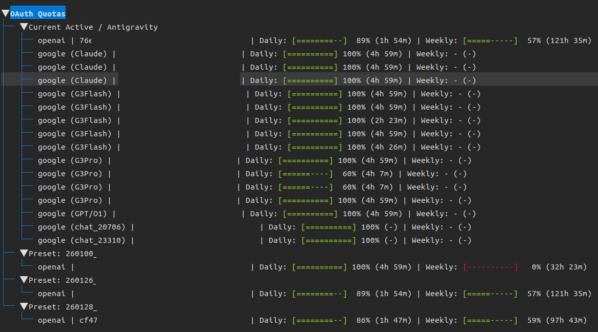

# OAuth Preset Manager (OPM)



**Manage your OAuth tokens like a pro.** Switch between multiple OpenAI/Google accounts instantly in OpenCode, check detailed quota usage, and keep your development flow uninterrupted.

---

## 🔥 Features

- **Instant Switching**: Swap `auth.json` configurations with a single command.
- **Quota Dashboard**: View real-time quota usage for OpenAI & Google (Antigravity) accounts.
  - Supports detailed breakdown for Antigravity models (Flash, Pro, Premium).
  - Visual progress bars and reset timers.
- **Auto-Detection**: Alerts you if the current auth doesn't match the selected preset.
- **TUI Interface**: Interactive terminal UI for easy management and monitoring.

## 🚀 Installation

Install directly from the repository:

```bash
# Clone and install
git clone https://github.com/kmss1258/oauth-preset-manager.git
cd oauth-preset-manager
./install.sh
```

Or install manually with pip:

```bash
pip install .
```

## 📖 Usage

### Interactive Mode (Recommended)
Just run `opm` to open the interactive menu:
```bash
opm
```
- Select a preset to switch.
- View detailed quotas.
- Save current configuration as a new preset.

### CLI Commands

**Switch Preset:**
```bash
opm switch <preset_name>
```

**Check Quotas:**
```bash
opm quota
# or
opm q
```
> Shows usage for all presets + currently active Antigravity session.

**Save Current Auth:**
```bash
opm save <new_preset_name>
```

## 🛠 Configuration

Presets are stored in `~/.local/share/opencode/presets/`.
The tool automatically detects your OpenCode `auth.json` location.

## 🤝 Contributing

Contributions are welcome! Please feel free to submit a Pull Request.

---
*Ultraworked with [Sisyphus](https://github.com/code-yeongyu/oh-my-opencode)*
