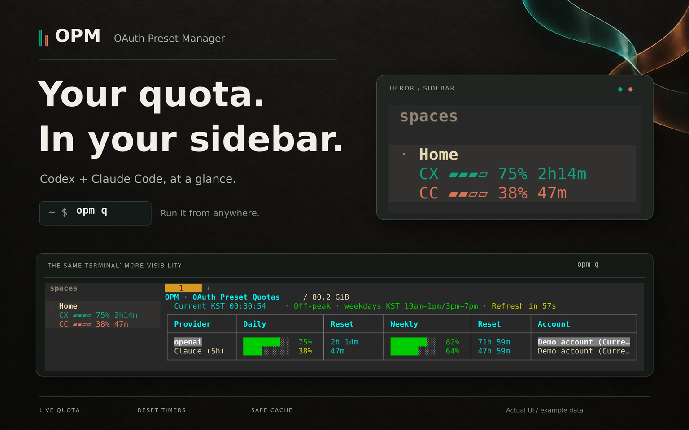

# OAuth Preset Manager (OPM) - Node.js Edition



*Actual Herdr UI captures with example quota data, presented in a custom hero illustration.*

**Manage your OAuth tokens like a pro.** Select one preset to switch the same OpenAI OAuth account in OpenCode, Codex and claude-code-proxy's Codex provider together, while preserving other provider entries and checking detailed quota usage.

Now rewritten in **Node.js** for better performance and cross-platform compatibility!

---

## ⚡ Quick Start

Install and run in one line:

```bash
curl -sSL https://raw.githubusercontent.com/kmss1258/oauth-preset-manager/main/install.sh | bash && opm
```

Re-run that same command later to update an existing install in place.

Or if already installed, just run:

```bash
opm
```

---

## 🔥 Features

- **Instant Switching**: Swap `auth.json` configurations with a single command.
- **Quota View**: View quota usage for OpenAI, Claude OAuth, Google (Antigravity), OpenCode Go, and Command Code.
  - Supports detailed breakdown for Antigravity models (Flash, Pro, Claude).
  - Visual progress bars and reset timers.
  - Account cells show at most two preset labels, newest `last_used` first (falling back to `created_at`; unknown dates come last). Command Code account details use at most two lines. This only limits display, not quota collection or account rows.
  - Mobile/narrow terminals use compact account rows with adaptive bars. At 100+ columns, the full table is shown. Window resizing updates the layout without fetching again.
  - Short screens are paginated: `j`/`k`, down/up arrows, or Page Down/Page Up. The countdown stays fixed; `g` toggles Google details, and `q`, Esc, Enter, or Ctrl-C exits. Interactive mode restores the previous terminal screen on exit.
  - `opm q` refreshes automatically every 60 seconds and shows the next-refresh countdown above the table.
  - Press `r` or `ㄱ` in `opm q` to refresh immediately without changing the current quota layout.
  - Shows fixed UTC peak periods Monday-Friday only (01:00–04:00 and 06:00–10:00 UTC; 10:00–13:00 and 15:00–19:00 KST), with a `HH:MM:SS` countdown one hour before and throughout each peak window. Weekends are off. Active peaks use a rotating pastel border in interactive terminals.
- **Auto-Detection**: Alerts you if the current auth doesn't match the selected preset.
- **Interactive CLI**: Beautiful interactive prompts with arrow key navigation.
- Includes an OpenAI-only interactive menu action that sends one `gpt-5.6-luna` request across saved OpenAI OAuth targets to kick quota back into motion after reset.
- Includes a credential distribution action: choose exact top-level auth entries first, then destination presets (all destinations are selected by default). Only selected keys are replaced; every other OAuth/API entry is preserved.
- OpenCode Go API credentials (`opencode-go:api`) are separate from the optional browser/usage session (`OpenCode Go OAuth session`). Sessions are stored as normalized sidecars in `~/.config/oauth-preset-manager/preset-sidecars/opencode-go/`, never inside `auth.json`.
- **Multi-language**: English & Korean support (auto-detected).

## 🚀 Installation

### Requirements
- Node.js 18+
- Git

### Quick Install
```bash
curl -sSL https://raw.githubusercontent.com/kmss1258/oauth-preset-manager/main/install.sh | bash
```
> The installer writes an `opm` launcher into the first writable directory on your PATH (or `~/.local/bin` as a fallback).

### Manual Install
```bash
git clone https://github.com/kmss1258/oauth-preset-manager.git
cd oauth-preset-manager
npm install
./install.sh
```

## 📖 Usage

### Interactive Mode (Recommended)
Just run `opm` to open the interactive menu:
```bash
opm
```
- Select a preset to switch.
- View detailed quotas.
- Run the OpenAI quota kickoff action when you want to send one lightweight `gpt-5.6-luna` request to each OpenAI OAuth target.
- Save current configuration as a new preset.
- Distribute selected credentials to selected presets. Legacy presets without a Go sidecar remain auth-only.

### CLI Commands

**Switch Preset:**
```bash
opm switch <preset_name>
```

**Check Quotas:**
```bash
opm quota
# or
opm q
```
> Shows usage for supported preset credentials and detected local provider sessions.
> Shows a full table on wide terminals, or compact progress bars on mobile/narrow terminals. Very small heights show only status/exit controls until enlarged. Piped output is a single, unpaginated snapshot without cursor controls.
> The interactive quota screen refreshes automatically every 60 seconds and shows the next refresh above the table. Press `r` or `ㄱ` to refresh immediately.
> Peak periods are fixed Monday-Friday schedules: 01:00–04:00 UTC / 10:00–13:00 KST and 06:00–10:00 UTC / 15:00–19:00 KST. Weekends are off. The peak countdown starts one hour before each period and uses `HH:MM:SS`; the pastel border is only shown during active peaks in TTY mode.

### Herdr: live quota under Spaces

Inside Herdr, run **`opm q` from anywhere, including `~`**. The normal quota screen stays open; the calling Space also shows two compact rows (example values):


*Actual Herdr terminal capture using example quota data. No real account details are shown.*

- **CX is green; CC is orange.** These are the active **native Codex and Claude Code file-backed accounts**, not a total of saved presets. The percentage is remaining quota; the time is until reset. Codex prefers a 5-hour window, falls back to its actual primary window, and labels weekly-only quotas `7d` (unknown windows: `quota`).
- No Herdr rebuild, extra pane, workspace rename, or daemon. Herdr 0.8.2's workspace metadata and styled Space rows are used. Only the expanded desktop sidebar shows custom rows; collapsed/mobile layouts do not.
- Quotas are fetched every 60 seconds; reset text and metadata lifetime update every 15 seconds. `r` / `ㄱ` also refreshes the sidebar, without bypassing HTTP 429 cooldown. Claude probes first and falls back to its last successful snapshot on failure: **`CC*` means cached**, not live. Without a usable snapshot, `login`, `expired`, `auth`, `429`, or `error` replaces unavailable percentages. The sidebar collector only performs usage GETs: it never refreshes tokens, rewrites auth, or sends inference requests.
- Quit `opm q` to clear its two rows. Forced termination expires the last report within 45 seconds. With multiple `opm q` processes in one Space, one reports and a waiting process takes over within 15 seconds when it exits. Other Spaces are independent; a pane moved to a different Space is followed on the next update.
- First use backs up the original Herdr config beside it (`config.toml.opm-backup-*`), preserves existing keys/theme/Space rows and comments, validates the added rows, and reloads Herdr. `HERDR_CONFIG_PATH` is respected. Unsupported/invalid config is not overwritten; a sidebar warning does not stop the regular quota screen. Outside Herdr or when output is piped, nothing is installed or reported.

References: [Herdr 0.8.2 sidebar configuration](https://herdr.dev/docs/0.8.2/configuration/), [workspace metadata](https://herdr.dev/docs/cli-reference/).

**Save Current Auth:**
```bash
opm save <new_preset_name>
```

## 🛠 Configuration

Presets are stored in `~/.config/oauth-preset-manager/presets/`.
The tool automatically detects your OpenCode `auth.json` location.
OpenCode uses XDG-style paths on both Linux and macOS, and honors `XDG_DATA_HOME` / `XDG_CONFIG_HOME` if you set them.

Common auth file locations:
- OpenCode: `~/.local/share/opencode/auth.json` or `~/.config/opencode/auth.json`
- Codex CLI: `~/.codex/auth.json` (updated by normal preset switching; read-only native source for the Herdr sidebar)
- claude-code-proxy, Codex provider only: `~/.config/claude-code-proxy/codex/auth.json`
- Command Code: `~/.commandcode/auth.json` (OPM also checks `~/.commandcode/oauth.json`)
- Claude Code: `~/.claude/.credentials.json`

### Environment Variables
- `OPM_LANG`: Set language (`ko` or `en`)
- `CODEX_HOME`: Codex-only directory override (surrounding whitespace trimmed; empty means `~/.codex`). A nonempty override never falls back to the default, even if missing or invalid.
- `CCP_CONFIG_DIR`: claude-code-proxy root override; OPM writes `<root>/codex/auth.json`. Without it, Linux uses `${XDG_CONFIG_HOME:-~/.config}/claude-code-proxy`, macOS uses `~/.config/claude-code-proxy`, and Windows uses `%APPDATA%/claude-code-proxy` (the usual `~/AppData/Roaming` fallback when unset). Surrounding whitespace is trimmed; a nonempty override never silently falls back after a path error.
- `OPM_ANTIGRAVITY_CLIENT_ID`: Required for Google/Antigravity quota refresh
- `OPM_ANTIGRAVITY_CLIENT_SECRET`: Required for Google/Antigravity quota refresh
- `OPENCODE_GO_WORKSPACE_ID`: OpenCode Go workspace ID (`wrk_...`) for `opm q` usage data
- `OPENCODE_GO_AUTH_COOKIE`: `auth` cookie from `opencode.ai` for OpenCode Go usage data
- `OPM_COMMAND_CODE_AUTH_PATH`: Optional Command Code credential path override
- `CLAUDE_CONFIG_DIR`: Claude Code profile directory (default `~/.claude`)
- `OPM_CLAUDE_AUTH_PATH`: Optional Claude Code `.credentials.json` path override; takes precedence over `CLAUDE_CONFIG_DIR`

### One Switch for Three Destinations

```bash
opm save work             # Snapshot OpenCode and retain a genuinely matching native ID bundle
opm switch work           # Apply the same OpenAI OAuth credentials to all three destinations
opm                       # Selecting a preset uses the same unified switch
```

There is no separate Codex/proxy preset selection or submenu. A preset with OpenAI OAuth (`openai` or its `codex` alias) automatically updates OpenCode, native Codex, and **only the Codex provider** of [raine/claude-code-proxy](https://github.com/raine/claude-code-proxy). Conflicting aliases are rejected before switching. Without OpenAI OAuth, Codex and proxy auth are explicitly skipped and their existing files/configuration are untouched.

- **Close OpenCode, Codex and claude-code-proxy before switching; restart all afterwards.** The proxy reads auth per request, but pooled websockets and concurrent token refreshes can keep old credentials or race writes. Runtime hot-reload is not guaranteed. Do not run concurrent switches, quota refreshes or logins. Escape/Ctrl-C cannot interrupt the CLI's pending unified switch.
- **File storage only when syncing OpenAI OAuth.** OPM parses the selected Codex home's `config.toml` with `@iarna/toml` (one dependency with no transitive dependencies). Normal unrelated multiline strings, arrays and inline tables work. A missing store setting uses the default file store; explicit `cli_auth_credentials_store` settings must be `"file"`, including profiles. Keyring, `auto`, malformed TOML and enabled encrypted-secret storage settings are rejected before refreshing or replacing targets. OPM never edits config. External launch flags/managed overrides must also use file storage; they are not inspected.
- **Save and recognition are offline.** A native ChatGPT bundle is retained only when its access and refresh tokens match the OpenCode entry exactly and available user/workspace claims agree. A shared business workspace/account ID is never sufficient. Genuine inline `id_token`/`idToken` values can also be retained. Existing native bytes, including unknown metadata and `last_refresh`, are preserved when reused.
- **Existing presets without an ID token require refresh on user switch.** OPM uses the existing OpenAI refresh grant and shared client ID. It requires a genuine returned JWT-shaped ID token and consistent available identity before writing any target. If the response still lacks an ID, the switch fails without replacing targets; OPM never synthesizes JWTs. Opaque access tokens are supported. A retained current bundle with known usable access expiry avoids unnecessary refresh. Missing/invalid expiry is derived from the access JWT's numeric `exp`, or obtained by refresh; ID-token expiry and guessed lifetimes are never substituted. Structural validation is not cryptographic signature or live login verification.
- Rotated access/refresh/expiry/account context is retained in the selected preset and active OpenCode auth, and the native ID/access/refresh/account/`last_refresh` bundle is stored at `~/.config/oauth-preset-manager/preset-sidecars/codex/<name>.json`. `opm_identity` preserves known user/subject/workspace claims across responses that omit an ID token; it is metadata, not a fabricated token.
- The proxy gets **flat JSON** with exactly `access`, `refresh`, `expires` (numeric Unix milliseconds), and canonical `accountId`. These are the exact final values also retained in OpenCode/the selected preset, not native Codex's nested `tokens` schema. Recognition accepts the proxy's legacy `account_id` alias but rejects conflicting aliases. OPM creates the Codex auth destination if missing, does not install/start the proxy or use an upload API, and never writes the proxy's other provider files or configuration.
- Existing targets are privately backed up under `backups/` before atomic replacement. Failure to back up aborts the switch. Any target/config write failure attempts to restore **every** affected file: OpenCode, Codex, proxy Codex auth, selected preset, linked bundle, applicable Go session and OPM config. This includes failure at the third destination after both prior apps were written. Managed files/directories use `0600`/`0700`. Symlinks, non-regular files, unsafe names and mutually overlapping auth roots/OPM internal destinations are refused.
- Recognition compares all three destinations for linked presets, regardless of last selection; Go environment overrides cannot bypass the Codex or proxy checks. It performs no refresh. Deletion removes the linked native bundle; credential distribution invalidates links that no longer match instead of keeping stale ID tokens.

Proxy format/path reference: [`src/paths.rs`](https://github.com/raine/claude-code-proxy/blob/55bf0b5818b461e1860964809726f99d2fd52c10/src/paths.rs) and [`src/providers/codex/auth/token_store.rs`](https://github.com/raine/claude-code-proxy/blob/55bf0b5818b461e1860964809726f99d2fd52c10/src/providers/codex/auth/token_store.rs).

#### Rotation Recovery

OAuth token rotation **cannot be rolled back remotely**. Before requesting refresh, OPM reserves a private `refresh-recovery/<SHA256(refresh)>.json` journal. It records the returned credentials **before any target write**, even if the response lacks a usable ID token. These records are not part of local rollback.

- A successful recorded rotation is followed on later switches, including duplicate presets that still hold the old refresh token. The old credentials are not silently restored from a stale linked bundle. Missing-ID responses require a later explicit switch to obtain a genuine ID using the returned refresh credentials.
- An unknown access token sharing an unchanged refresh token is **not assumed newer or older** than a recovery journal. Recognition, kickoff and quota recovery fail closed. An explicit preset switch must revalidate it through refresh, even if an old native sidecar matches. A fresh login is not permanently blocked merely for unknown access lineage, but it must produce a valid, identity-consistent refresh response before installation.
- A transport failure leaves a pending record because rotation may already have occurred. Preserve it and log in again, then save the fresh login credentials. Incomplete/conflicting recovery data fails closed rather than guessing.
- If the response journal cannot be written, OPM attempts an independent `backups/rotated_openai_recovery_*.json` copy and reports the recovery caveat without printing tokens. Keep both clients and the proxy closed while resolving a partial rollback; preserve `refresh-recovery/` and `backups/` for manual recovery. Do not blindly delete recovery records or reapply an old refresh token.
- Recovery records/backups contain credentials and are intentionally retained, including after deleting a preset because another preset may share the refresh lineage. Protect them. Trusted, non-shared storage ancestors are required. Caught-error rollback is not a crash-safe multi-file transaction and cannot guarantee recovery after process termination or power loss.

**Quota scope:** Native Codex and proxy auth are not extra rows in the regular quota table and are not rewritten by quota collection. The Herdr sidebar separately reads native Codex auth for its CX row. Existing OpenCode OAuth refreshes retain returned ID data or invalidate the stale linked bundle, with recovery records protecting later switches. The top-level OpenCode `codex` key remains an OpenAI OAuth alias.

### Claude OAuth quota

`opm q` detects `claudeAiOauth.accessToken` in the Claude Code credential file, plus `anthropic` entries with `type: "oauth"` in active OpenCode auth and saved presets. Identical access tokens share one request; API keys are ignored. No Claude credentials means no Claude row.

- Shows **remaining** 5-hour and weekly quota, plus model-specific weekly/extra-usage percentages when returned. The Claude table row labels its first window `5h` (not a calendar day).
- Reads the internal `https://api.anthropic.com/api/oauth/usage` endpoint with `anthropic-beta: oauth-2025-04-20`. Supports both legacy windows and newer `limits[]` responses. This is not a public stable Anthropic API.
- Requires usage/profile permission (`user:profile`); inference-only tokens may not work. Expired/unauthorized credentials show a re-login message. OPM **never refreshes, copies, or rewrites Claude credentials** as part of quota collection.
- **Query first, cache on failure:** each refresh attempts a live read. If it fails, the last successful snapshot (up to 24 hours old) remains visible with a cache-age/failure note; the Herdr sidebar uses `CC*`. Never-successful or older snapshots do not invent quota values. Reset timestamps stay absolute; cached percentages are not reset to 100% when time passes.
- Normalized percentages/reset times and HTTP 429 cooldown are stored privately in `~/.config/oauth-preset-manager/claude-quota-cache/`, keyed by a SHA-256 hash of the exact access token. No token or raw error body is saved. This lets cache fallback and `Retry-After` survive restarting `opm q`; without `Retry-After`, 429 waits five minutes. Manual refresh cannot bypass that cooldown. Different tokens never borrow one another's values, and missing/invalid local credentials still require login. Overlapping table/sidebar requests in one process are coalesced. Cache I/O failures do not block live queries.
- macOS Keychain-only credentials are **not read automatically**. Use an existing file-backed Claude profile or an OpenCode Anthropic OAuth entry. Keep credential files private (`chmod 600`); symlinked local Claude credential files are ignored.

References: [CodexBar OAuth fetcher/schema](https://github.com/steipete/CodexBar/blob/170a4d41c6d69e2bb25daac4fb088a92de2f9bc4/Sources/CodexBarCore/Providers/Claude/ClaudeOAuth/ClaudeOAuthUsageFetcher.swift), [Headroom client](https://github.com/headroomlabs-ai/headroom/blob/e67b3c8a29443a60d6b0018fb22f525c5cd7e709/headroom/subscription/client.py), [Claude Code authentication](https://code.claude.com/docs/en/authentication).

### OpenCode Go session

OpenCode Go usage is read from its workspace page and shows the 5-hour, weekly, and monthly windows. Its API key enables Go models, but the usage page currently requires the browser `auth` cookie as well.

You may store those two values in `~/.config/oauth-preset-manager/opencode-go.json` instead; environment variables take precedence. Keep this file private:

```json
{
  "workspaceId": "wrk_...",
  "authCookie": "Fe26.2**..."
}
```

```bash
chmod 600 ~/.config/oauth-preset-manager/opencode-go.json
```

The stored Go file is the only source used when saving or distributing a Go OAuth session. `OPENCODE_GO_WORKSPACE_ID` and `OPENCODE_GO_AUTH_COOKIE` are runtime quota overrides and are never persisted into presets or sidecars. Switching a preset with a sidecar restores its session; switching to a legacy preset leaves the current global Go session unchanged.

Go sidecars are stored outside the preset JSON files at `~/.config/oauth-preset-manager/preset-sidecars/opencode-go/<preset>.json` with restricted permissions.
If the stored global Go session is missing or malformed, saving/overwriting a preset leaves any existing sidecar unchanged; clearing a session is never inferred from absent data.

## 📝 Project Structure

```
.
├── src/
│   ├── cli.js          # Main CLI entry point
│   ├── core.js         # PresetManager and quota logic
│   ├── codex.js        # Codex/proxy auth formats and safe file operations
│   └── i18n.js         # Translations (KO/EN)
├── package.json        # Node.js package config
├── install.sh          # Quick installer
└── README.md
```

## 🤝 Contributing

Contributions are welcome! Please feel free to submit a Pull Request.

---
*Ultraworked with [Sisyphus](https://github.com/code-yeongyu/oh-my-opencode)*
